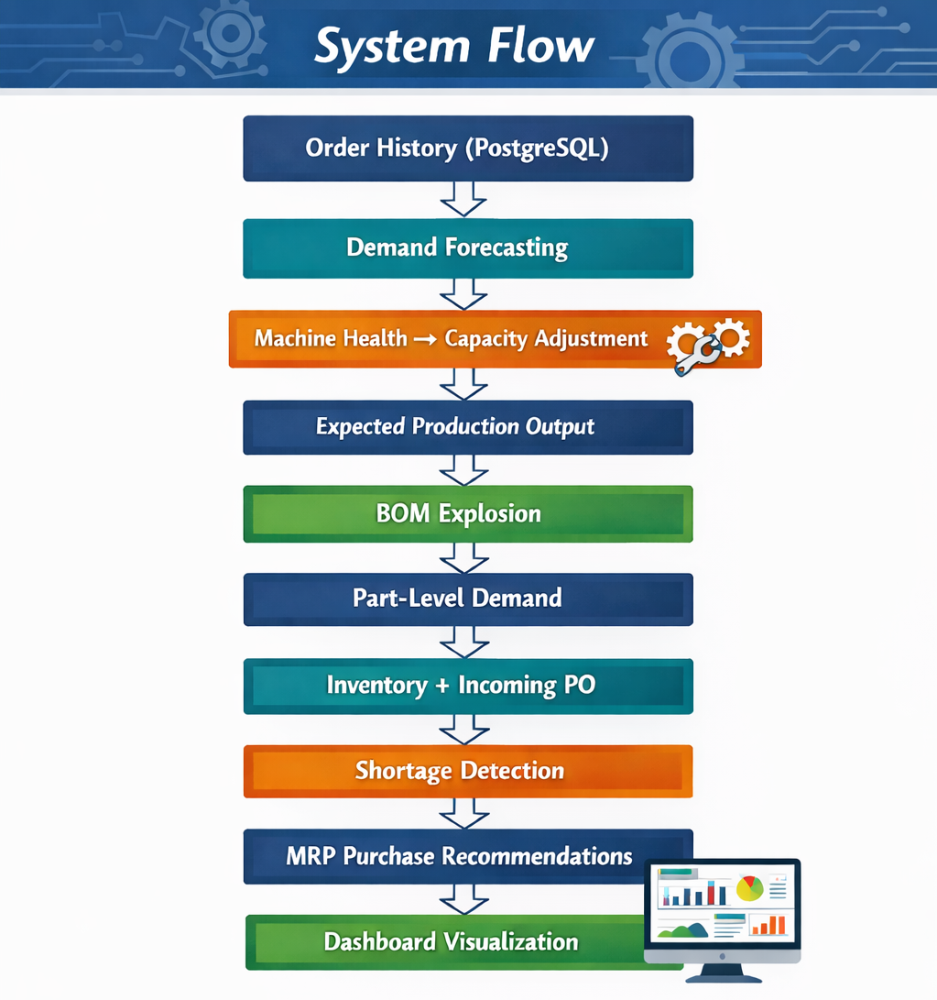

# 🏭 Smart Manufacturing MRP & IoT Simulation Dashboard


---

## 📌 Overview

In manufacturing environments, production planning, machine conditions, and procurement decisions are often handled in separate systems.

This project demonstrates how to integrate:
- IoT machine data
- ERP inventory & BOM
- Order demand signals

into a unified decision-making workflow.

It answers a key question:

👉 "What happens to procurement and production plans when machine performance degrades?"

By combining forecasting, capacity adjustment, and MRP logic, this system provides a **forward-looking view of demand risk and material shortages**.

---

## 🔄 System Flow

The system processes data through a multi-stage pipeline:

---

## 🚀 Key Features
This project simulates a production decision system where data flows across multiple layers.
### 🔧 Industrial IoT Simulation
- Simulates real-time machine sensor data:
  - Temperature
  - Vibration
  - RPM
- Generates continuous streaming data via a Python-based simulator
- Calculates **machine health score** dynamically

---

### 📈 Demand Forecasting
- Uses recent order history (PostgreSQL)
- Computes **weekday-based averages**
- Generates a **7-day demand forecast**
- Applies machine health as a **capacity adjustment factor**

---

### 📦 MRP Material Planning

Instead of a static MRP model, this project implements a **time-based shortage-driven planning logic**:

- Detects shortage on each future date
- Backward calculates order date using lead time
- Separates:
  - Market demand (forecast)
  - Executable output (capacity-adjusted)

This reflects a key real-world challenge:

👉 Demand does not equal producible output
---

### 📊 Real-Time Dashboard
Built with **Flask + Plotly**

- IoT machine monitoring
- Demand comparison (Original vs Adjusted)
- Purchase recommendations
- Risk part detection
- Auto-refresh every few seconds

---

## 🏗 System Architecture

This system is designed as a modular data pipeline integrating multiple layers:

### 1. Data Layer
- **PostgreSQL**: Order transactions (demand source)
- **MySQL**: ERP data (BOM, inventory, machine data)

### 2. Simulation Layer
- IoT simulator generates real-time machine sensor data

### 3. Service Layer
- Demand forecasting
- Machine health evaluation
- Capacity adjustment
- MRP calculation

### 4. API Layer
- Flask-based API serving processed data to frontend

### 5. Visualization Layer
- Plotly dashboard for monitoring and decision support

---

## 🛠️ Tech Stack

- Python
- Flask
- Pandas
- Plotly
- MySQL
- PostgreSQL
- Docker / Docker Compose
- python-dotenv

---

## ⚡ Quick Start (Recommended)

```bash
git clone https://github.com/both1108/mrp-python.git
cd mrp-python

cp .env.example .env

docker compose up --build
```

Open browser:

```
http://localhost:5000
```

---

## ⚙️ Environment Variables

Example `.env`:

```env
# MySQL (ERP + IoT)
MYSQL_HOST=mysql
MYSQL_PORT=3306
MYSQL_USER=root
MYSQL_PASSWORD=root
MYSQL_DB=erp

# PostgreSQL (Orders)
PG_HOST=postgres
PG_PORT=5432
PG_USER=user
PG_PASSWORD=password
PG_DB=transactions
```

---

## 🤖 IoT Data Simulator

- Automatically runs as a Docker service
- Continuously inserts simulated machine data
- Updates every few seconds
- Keeps only the latest 30 minutes of data (auto-cleanup)

---

## 🔧 Refactoring

This project was originally implemented as a single script and later refactored into a modular architecture.

- Separated business logic into service layers
- Improved code readability and maintainability
- Preserved identical outputs before and after refactoring

This demonstrates the transition from **script-based coding to system-oriented design**.

---

## 🎯 Key Insights

This project highlights several real-world manufacturing challenges:

- Machine degradation directly impacts production capacity
- Forecast demand must be distinguished from executable output
- Material shortages should be identified **before they happen**, not after
- Procurement decisions can be derived from forward-looking simulation

It demonstrates how disconnected data sources can be transformed into a **predictive decision support system**.
---

## 🧠 What This Project Demonstrates

- End-to-end system design for manufacturing analytics
- Integration across IoT, ERP, and transactional systems
- Translating business problems into data pipelines and logic
- Designing decision-support systems instead of static reports
---

## 💡 Future Improvements

- Machine learning-based forecasting  
- More realistic failure prediction models  
- API authentication & security  
- Cloud deployment (AWS / GCP)  
- Streaming pipeline (Kafka / Spark)

## ⚠️ Limitations

This project is a Proof-of-Concept (POC) and does not include:

- Detailed routing / production scheduling
- Part-specific lead times or supplier constraints
- MOQ / lot size constraints
- Real-time streaming infrastructure

It focuses on validating the integration and decision logic rather than full production deployment.